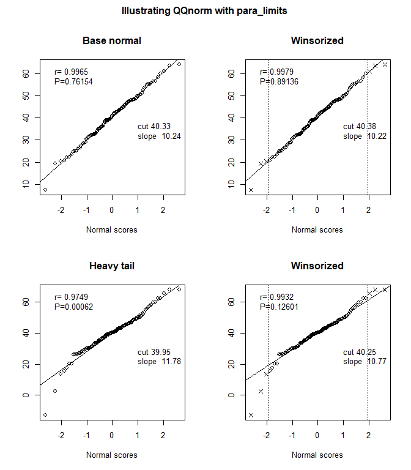

<!-- README.md is generated from README.Rmd. Please edit that file -->

# QQreflimits

<!-- badges: start -->

<!-- badges: end -->

The goal of QQreflimits is to provide routines for finding reference
limits using, where appropriate, QQ methodology. All use a data vector X
of cases from the reference population. The default is to get the
central 95% reference range of the population, namely the 2.5 and 97.5
percentiles.

- In some settings we want the 99% range.

- Sometimes we want only one of these limits – for example the upper 95%
  point.  

- Along with the reference limit, we want a confidence interval which,
  for historical reasons, is typically at 90% confidence. A full
  analysis provides six numbers:

  - the upper and the lower reference limits, and
  - each of their confidence intervals.

## Installation

You can install the development version of QQreflimits like so:

``` r
install.packages("QQreflimits")  # once available on CRAN
```

## Example

This is a basic example which shows you how to solve a common problem:

``` r
library(QQreflimits)

# parameters
mu    <- 40
sigma <- 10
n     <- 120
# identifying winsoring
wins  <- trunc(n/40)
# replicable randomization
set.seed(1069)
X     <- mu + sigma*rnorm(n)
# replicable randomization with heavy tails
set.seed(1069)
HT    <- mu + sigma * rt(n, 5)

# visual settings
par(mfrow=c(2,2))
par(oma=c(0,0,2,0))
# plot to compare
base <- QQnorm(X, main="Base normal", showsum=TRUE)
title("Illustrating QQnorm with para_limits", outer=TRUE)
basew <- QQnorm(X, main="Winsorized", winsor=wins, showsum=TRUE)
ht   <- QQnorm(HT, main="Heavy tail", showsum=TRUE)
htw  <- QQnorm(HT, main="Winsorized", winsor=wins, showsum=TRUE)
```



``` r

# evaluate and review
norm_results <- para_limits(mean(X), sd(X), n)
norm_results
#> $lower
#> [1] 20.21278 17.57878 22.84678
#> 
#> $upper
#> [1] 60.44854 57.81454 63.08255
#> 
#> $effn
#> [1] 120
# evaluate and review with tails
tailed_results <- para_limits(htw$intercept, htw$slope, n, winsor=wins)
tailed_results
#> $lower
#>             ns[QQrange] ns[QQrange] 
#>    19.14649    16.25381    22.03916 
#> 
#> $upper
#>             ns[QQrange] ns[QQrange] 
#>    61.35614    58.46346    64.24881 
#> 
#> $effn
#> [1] 109.5
```
